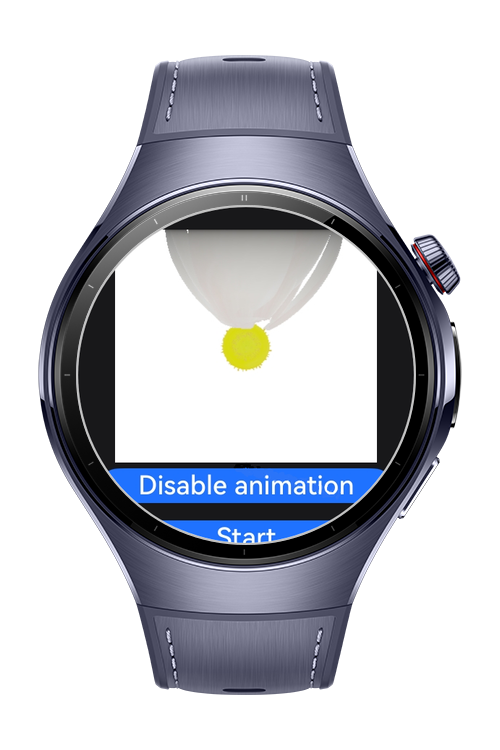
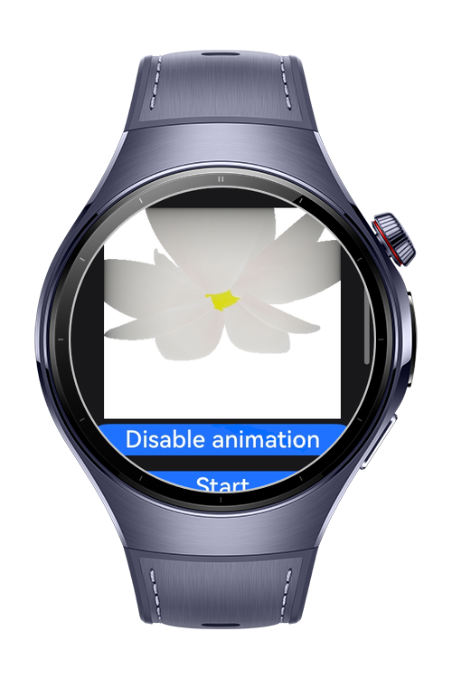
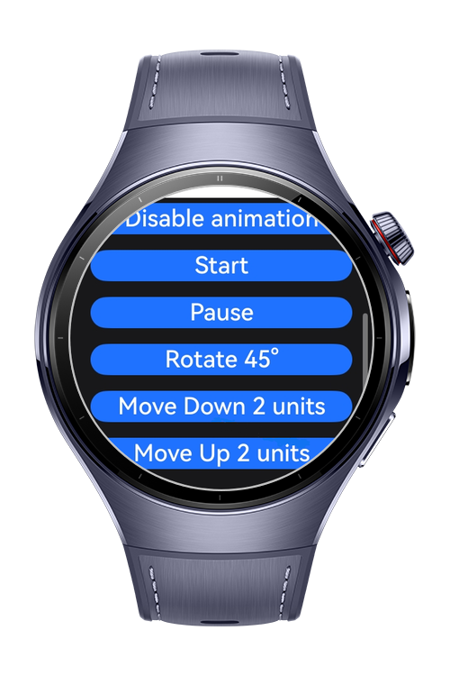

> **Note:** To access all shared projects, get information about environment setup, and view other guides, please visit [Explore-In-HMOS-Wearable Index](https://github.com/Explore-In-HMOS-Wearable/hmos-index).

# How to Control 3D Models with ArkGraphics 3D

This codelab shows how to use ArkGraphics 3D to manipulate a 3D model. You will learn how to rotate, move, and manage animations on a glTF/glb model within a scene.

# Preview

<div>



</div>

# Use Cases

- Interactive product display (rotate/zoom objects).
- Educational apps for visualizing 3D structures.
- Simple game prototypes with object movement and animation control.

# Tech Stack

- Languages: ArkTS (Ark TypeScript)
- Frameworks: HarmonyOS SDK 5.1.0 (API Version 18)
- Tools: DevEco Studio Version 5.1.0.842
- Libraries & Kits:
    - @kit.ArkGraphics3D Used for rendering 3D models.

# Directory Structure

```
|---pages
|   |---ArkGraphics.ets          # Entry screen with 3D model management
|   |---Index.ets               # Entry point for routing and initialization

|---utils
|   |---Constants.ets           # Application constants and config values
|   |---Logger.ets              # Logging and debugging helper
```

# Constraints and Restrictions

## Supported Devices

- Huawei Watch 5
- Devices running HarmonyOS 5.1.0 (API 18) and above


# Licence

ArkGraphics3DAnimation is distributed under the terms of the MIT License
See the [LICENSE](./LICENSE) for more information.
